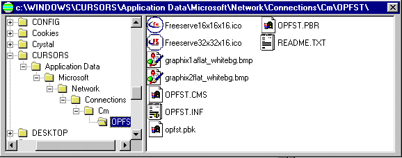



## VBExplorer

### Description

TreeView and ListView controls are not exactly well documented and few good examples are currently available to learn from. What I hope I have achieved in this small demo, is to bind these controls in such a way that the VB application mimics MS Explorer.
 
### More Info
 
None Known

             |
---                |---
**Submitted On**   |2001-09-13 19:04:42
**By**             |[Kev Heywood](https://github.com/Planet-Source-Code/PSCIndex/blob/master/ByAuthor/kev-heywood.md)
**Level**          |Intermediate
**User Rating**    |4.0 (8 globes from 2 users)
**Compatibility**  |VB 5\.0, VB 6\.0
**Category**       |[Complete Applications](https://github.com/Planet-Source-Code/PSCIndex/blob/master/ByCategory/complete-applications__1-27.md)
**World**          |[Visual Basic](https://github.com/Planet-Source-Code/PSCIndex/blob/master/ByWorld/visual-basic.md)
**Archive File**   |[VBExplorer263779132001\.zip](https://github.com/Planet-Source-Code/kev-heywood-vbexplorer__1-27209/archive/master.zip)

